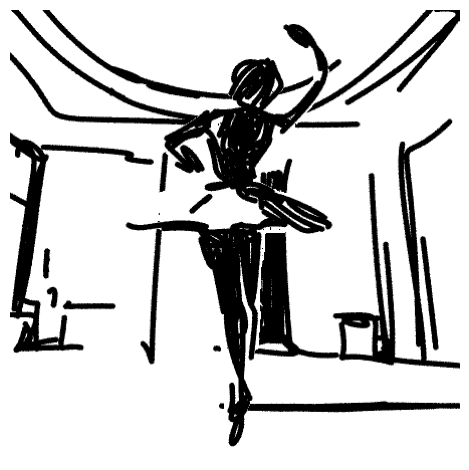
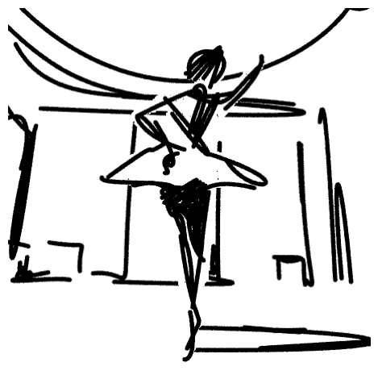

CLIPascene
==========

.. _clipascene:

`[Project] <https://clipascene.github.io/CLIPascene/>`_ `[Paper] <https://arxiv.org/abs/2211.17256>`_ `[Code] <https://github.com/yael-vinker/SceneSketch>`_

The CLIPascene algorithm was proposed in *CLIPascene: Scene Sketching with Different Types and Levels of Abstraction*.

The abstract from the paper is:

`In this paper, we present a method for converting a given scene image into a sketch using different types and multiple levels of abstraction. We distinguish between two types of abstraction. The first considers the fidelity of the sketch, varying its representation from a more precise portrayal of the input to a looser depiction. The second is defined by the visual simplicity of the sketch, moving from a detailed depiction to a sparse sketch. Using an explicit disentanglement into two abstraction axes — and multiple levels for each one — provides users additional control over selecting the desired sketch based on their personal goals and preferences. To form a sketch at a given level of fidelity and simplification, we train two MLP networks. The first network learns the desired placement of strokes, while the second network learns to gradually remove strokes from the sketch without harming its recognizability and semantics. Our approach is able to generate sketches of complex scenes including those with complex backgrounds (e.g. natural and urban settings) and subjects (e.g. animals and people) while depicting gradual abstractions of the input scene in terms of fidelity and simplicity.`

**Examples:**

CLIPascene converts an image of scene image into a sketch using different types and multiple levels of abstraction.

note: first download the `U2Net <https://huggingface.co/akhaliq/CLIPasso/blob/main/u2net.pth>`_ model, and put the model in :file:`./checkpoint/u2net/u2net.pth`.

Convert an image of *ballerina* from the original PNG format to an abstract sketch:

.. code-block:: console

   $ python svg_render.py x=clipascene target='./data/ballerina.png'

You will get the following result:

Convert an image of *ballerina* from the original PNG format to a sketch with a different level of abstraction:

.. code-block:: console

   $ python svg_render.py x=clipascene target='./data/ballerina.png' x.num_paths=32

You will get the following result:

