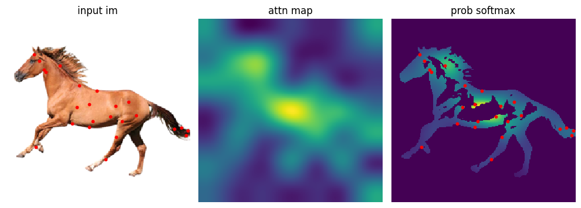

CLIPasso
==========

.. _clipasso:

`[Project] <https://clipasso.github.io/clipasso/>`_ `[Paper] <https://arxiv.org/abs/2202.05822>`_ `[Code] <https://github.com/yael-vinker/CLIPasso>`_

The CLIPasso algorithm was proposed in *CLIPasso: Semantically-Aware Object Sketching*.

The abstract from the paper is:

`Abstraction is at the heart of sketching due to the simple and minimal nature of line drawings. Abstraction entails identifying the essential visual properties of an object or scene, which requires semantic understanding and prior knowledge of high-level concepts. Abstract depictions are therefore challenging for artists, and even more so for machines. We present an object sketching method that can achieve different levels of abstraction, guided by geometric and semantic simplifications. While sketch generation methods often rely on explicit sketch datasets for training, we utilize the remarkable ability of CLIP (Contrastive-Language-Image-Pretraining) to distill semantic concepts from sketches and images alike. We define a sketch as a set of Bézier curves and use a differentiable rasterizer to optimize the parameters of the curves directly with respect to a CLIP-based perceptual loss. The abstraction degree is controlled by varying the number of strokes. The generated sketches demonstrate multiple levels of abstraction while maintaining recognizability, underlying structure, and essential visual components of the subject drawn.`

**Examples:**

CLIPasso converts an image of an object to a sketch, allowing for varying levels of abstraction, while preserving its key visual features.

.. note::

   first download the `U2Net <https://huggingface.co/xingxm/PyTorch-SVGRender-models/resolve/main/u2net.zip>`_ model, and put the model in :file:`./checkpoint/u2net/u2net.pth`.

Convert an image of *a horse* from the original PNG format to an abstract sketch:

.. code-block:: console

   $ python svg_render.py x=clipasso target='./data/horse.png'

sketch format:

- Rendering size: 224x224
- Strokes type: cubic Bezier curves
- Stroke width: 1.5

**Strokes Initialization**:

   Fig 1. A saliency map is used as the distribution to sample the initial strokes locations.

**Result**:

.. list-table:: Fig 2. Rendering Result

    * - .. figure:: ../../data/horse.png
           :width: 224

           Input image

      - .. figure:: ../../examples/clipasso/horse-8paths.svg
           :width: 224

           Vector Sketch, Number of strokes: 8

      - .. figure:: ../../examples/clipasso/horse-16paths.svg
           :width: 224

           Vector Sketch, Number of strokes: 16

      - .. figure:: ../../examples/clipasso/horse-24paths.svg
           :width: 224

           Vector Sketch, Number of strokes: 24