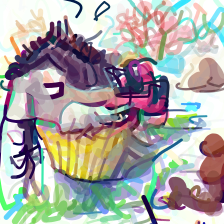
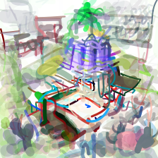
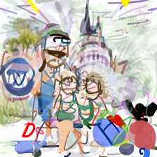
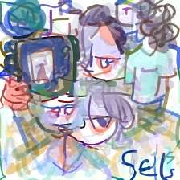

CLIPDraw
==========

.. _clipdraw:

`[Paper] <https://arxiv.org/abs/2106.14843>`_ `[Code] <https://github.com/kvfrans/clipdraw>`_

The CLIPDraw algorithm was proposed in *CLIPDraw: Exploring Text-to-Drawing Synthesis through Language-Image Encoders*.

The abstract from the paper is:

`CLIPDraw is an algorithm that synthesizes novel drawings from natural language input. It does not require any additional training; rather, a pre-trained CLIP language-image encoder is used as a metric for maximizing similarity between the given description and a generated drawing. Crucially, CLIPDraw operates over vector strokes rather than pixel images, which biases drawings towards simpler human-recognizable shapes. Results compare CLIPDraw with other synthesisthrough-optimization methods, as well as highlight various interesting behaviors of CLIPDraw, such as satisfying ambiguous text in multiple ways, reliably producing drawings in diverse styles, and scaling from simple to complex visual representations as stroke count increases.`

**Example 1: A Cat**

CLIPDraw synthesizes SVGs based on text prompts.

Synthesize *a cat*:

.. code-block:: console

   $ python svg_render.py x=clipdraw prompt='a photo of a cat'

**Result**:

.. figure:: ../../examples/clipdraw/cat.svg
   :align: center

   Fig 1. textual prompt: "a photo of a cat"

**Example 2: Horse eating a cupcake**

.. code-block:: console

   $ python svg_render.py x=clipdraw prompt='Horse eating a cupcake'

**Result**:

   Fig 2. textual prompt: "Horse eating a cupcake"

**Example 3: 3D Temple**

.. code-block:: console

   $ python svg_render.py x=clipdraw prompt='A 3D rendering of a temple'

**Result**:

   Fig 3. textual prompt: "A 3D rendering of a temple"

**Example 4: Family Vacation**

.. code-block:: console

   $ python svg_render.py x=clipdraw prompt='Family vacation to Walt Disney World'

**Result**:

   Fig 4. textual prompt: "Family vacation to Walt Disney World"

**Example 5: Self**

.. code-block:: console

   $ python svg_render.py x=clipdraw prompt='self'

**Result**:

   Fig 5. textual prompt: "self"