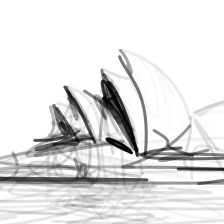
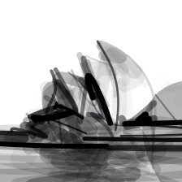
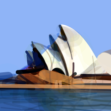
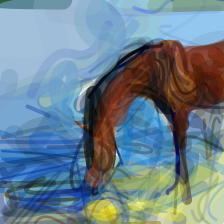

DiffSketcher
===============

.. _diffsketcher:

`[Project] <https://ximinng.github.io/DiffSketcher-project/>`_ `[Live] <https://neurips.cc/virtual/2023/poster/72425>`_ `[Paper] <https://arxiv.org/abs/2306.14685>`_ `[Code] <https://github.com/ximinng/DiffSketcher>`_

The DiffSketcher algorithm was proposed in *DiffSketcher: Text Guided Vector Sketch Synthesis through Latent Diffusion Models*.

The abstract from the paper is:

`Even though trained mainly on images, we discover that pretrained diffusion models show impressive power in guiding sketch synthesis. In this paper, we present DiffSketcher, an innovative algorithm that creates vectorized free-hand sketches using natural language input. DiffSketcher is developed based on a pre-trained text-to-image diffusion model. It performs the task by directly optimizing a set of Bézier curves with an extended version of the score distillation sampling (SDS) loss, which allows us to use a raster-level diffusion model as a prior for optimizing a parametric vectorized sketch generator. Furthermore, we explore attention maps embedded in the diffusion model for effective stroke initialization to speed up the generation process. The generated sketches demonstrate multiple levels of abstraction while maintaining recognizability, underlying structure, and essential visual details of the subject drawn. Our experiments show that DiffSketcher achieves greater quality than prior work. The code and demo of DiffSketcher can be found at https://ximinng.github.io/DiffSketcher-project/.`

**Examples:**

DiffSketcher synthesizes vector sketches based on text prompts.

Synthesize *a sketch of a photo of Sydney opera house*:

.. code-block:: console

   $ python svg_render.py x=diffsketcher prompt='a photo of Sydney opera house' x.token_ind=5 seed=8019 x.num_paths=96

You will get the following result:

Synthesize *a sketch of a photo of Sydney opera house*, where the width of the strokes is also optimized:

.. code-block:: console

   $ python svg_render.py x=diffsketcher prompt='a photo of Sydney opera house' x.token_ind=5 x.optim_width=True seed=8019 x.num_paths=96

You will get the following result:

Synthesize *a colorful sketch of a photo of Sydney opera house*, where the width of the strokes is also optimized:

.. code-block:: console

   $ python svg_render.py x=diffsketcher prompt='a photo of Sydney opera house' x.token_ind=5 x.optim_width=True x.optim_rgba=True x.optim_opacity=False seed=8019

You will get the following result:

Synthesize a sketch of *a photo of a horse drinking water by the lake* in the style of *Van Gogh's Starry Night*:

.. code-block:: console

   $ python svg_render.py x=stylediffsketcher prompt='A horse is drinking water by the lake' x.token_ind=5 target='./data/starry.png' seed=998

You will get the following result:

