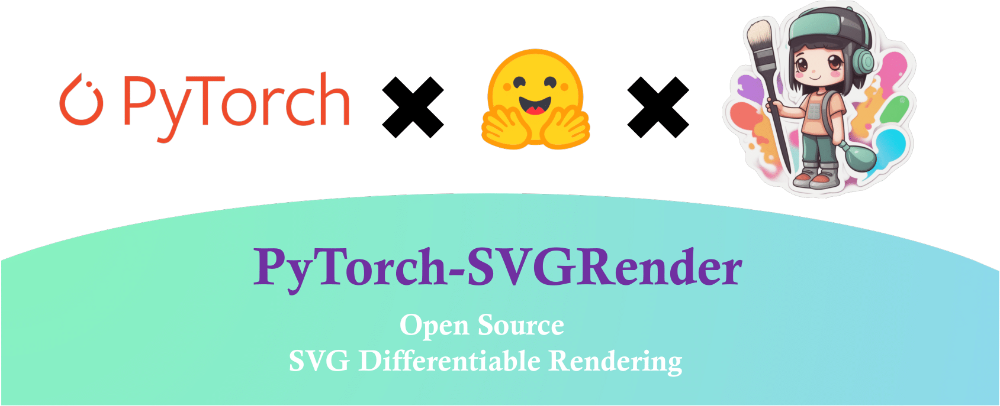

Welcome to PyTorch-SVGRender documentation!
===================================

.. raw:: html

    
<strong>Pytorch-SVGRender</strong> is the go-to library for state-of-the-art differentiable rendering methods for image vectorization.

PyTorch-SVGRender originated within academic research and has since undergone extensive development and consolidation through practical implementation,
driven by the overarching objective of propelling advancements in the realm of vector graphics rendering.

.. note::

   This project is under active development.

Installation
-----------

:doc:`Installation <install>`
    How to install the PyTorch-SVGRender.

Table of Contents
-----------

:doc:`DiffVG: Differentiable Vector Graphics Rasterization for Editing and Learning <diffvg>`
    Differentiable Vector Graphics Rasterization.

:doc:`CLIPDraw: Exploring Text-to-Drawing Synthesis through Language-Image Encoders <clipdraw>`
    Task: **Text-to-SVG**

:doc:`StyleCLIPDraw: Coupling Content and Style in Text-to-Drawing Translation <styleclipdraw>`
    Task: **Text-and-Img-to-SVG**

:doc:`LIVE: Towards Layer-wise Image Vectorization <live>`
    Task: **Img-to-SVG**

:doc:`CLIPFont: Texture Guided Vector WordArt Generation <clipfont>`
    Task: **Text-and-Glyph-to-Glyph**

:doc:`CLIPasso: Semantically-Aware Object Sketching <clipasso>`
    Task: **Img-to-Sketch**

:doc:`CLIPascene: Scene Sketching with Different Types and Levels of Abstraction <clipascene>`
    Task: **Img-to-Sketch**

:doc:`VectorFusion: Text-to-SVG by Abstracting Pixel-Based Diffusion Models <vectorfusion>`
    Task: **Text-to-SVG**

:doc:`DiffSketcher: Text Guided Vector Sketch Synthesis through Latent Diffusion Models <diffsketcher>`
    Task: **Text-to-Sketch**

:doc:`Word-As-Image: Word-As-Image for Semantic Typography <wordasimage>`
    Task: **Text-and-Glyph-to-Glyph**

:doc:`SVGDreamer: Text Guided SVG Generation with Diffusion Model <svgdreamer>`
    Task: **Text-to-SVG**

API Documentation
-----------

:doc:`API <api>`
    TODO

.. Hidden TOCs

.. toctree::
   :caption: How to install
   :maxdepth: 1
   :hidden:

   install

.. toctree::
   :caption: Methods
   :maxdepth: 1
   :hidden:

   diffvg
   clipdraw
   styleclipdraw
   live
   clipfont
   clipasso
   clipascene
   vectorfusion
   diffsketcher
   wordasimage
   svgdreamer

.. toctree::
   :caption: API Documentation
   :maxdepth: 1
   :hidden:

   api

About Us
----------

.. bibliographic fields (which also require a transform):

:Authors: Ximing Xing and Juncheng Hu
:Contact: ximingxing@gmail.com
:Organization: https://huggingface.co/SVGRender @BUAA
:Status: This is a "work in progress"
:Version: 1.0
:Copyright: 2024, Ximing Xing
:Licence: This work is licensed under a **Mozilla Public License Version 2.0**
