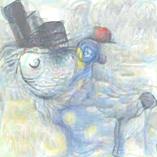

StyleCLIPDraw
===============

.. _styleclipdraw:

`[Live] <https://slideslive.com/38970834/styleclipdraw-coupling-content-and-style-in-texttodrawing-synthesis?ref=account-folder-92044-folders>`_ `[Paper] <https://arxiv.org/abs/2202.12362>`_ `[Code] <https://github.com/pschaldenbrand/StyleCLIPDraw>`_

The StyleCLIPDraw algorithm was proposed in *StyleCLIPDraw: Coupling Content and Style in Text-to-Drawing Translation*.

The abstract from the paper is:

`Generating images that fit a given text description using machine learning has improved greatly with the release of technologies such as the CLIP imagetext encoder model; however, current methods lack artistic control of the style of image to be generated. We present an approach for generating styled drawings for a given text description where a user can specify a desired drawing style using a sample image. Inspired by a theory in art that style and content are generally inseparable during the creative process, we propose a coupled approach, known here as StyleCLIPDraw, whereby the drawing is generated by optimizing for style and content simultaneously throughout the process as opposed to applying style transfer after creating content in a sequence. Based on human evaluation, the styles of images generated by StyleCLIPDraw are strongly preferred to those by the sequential approach. Although the quality of content generation degrades for certain styles, overall considering both content and style, StyleCLIPDraw is found far more preferred, indicating the importance of style, look, and feel of machine generated images to people as well as indicating that style is coupled in the drawing process itself. Our code, a demonstration, and style evaluation data are publicly available.`

**Examples:**

StyleCLIPDraw synthesizes SVG based on a text prompt and a reference image.

Synthesize *A sheep wearing a top hat* in the style of *Starry Night by Vincent van Gogh*:

.. code-block:: console

   $ python svg_render.py x=styleclipdraw prompt='A sheep wearing a top hat.' target='./data/starry.png'

You will get the following result:

