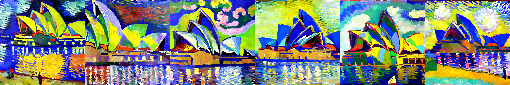
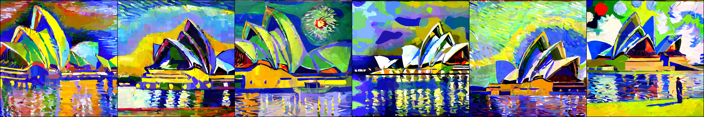
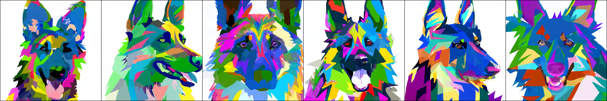
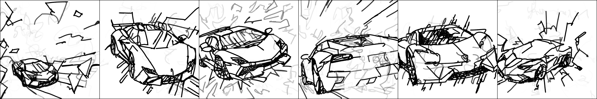
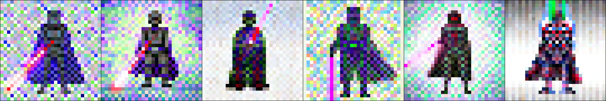
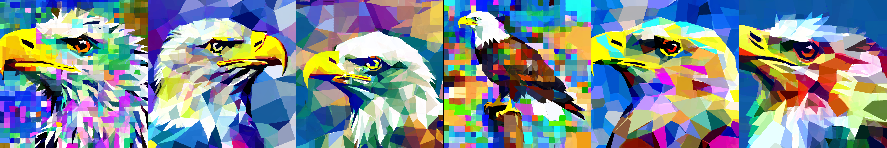
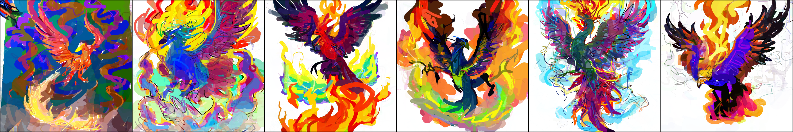

SVGDreamer
===============

.. _svgdreamer:

`[Project] <https://ximinng.github.io/SVGDreamer-project/>`_ `[Paper] <https://arxiv.org/abs/2312.16476>`_ `[Code] <https://github.com/ximinng/SVGDreamer>`_

The SVGDreamer algorithm was proposed in *SVGDreamer: Text Guided SVG Generation with Diffusion Model*.

The abstract from the paper is:

`Recently, text-guided scalable vector graphics (SVGs) synthesis has shown promise in domains such as iconography and sketch. However, existing text-to-SVG generation methods lack editability and struggle with visual quality and result diversity. To address these limitations, we propose a novel text-guided vector graphics synthesis method called SVGDreamer. SVGDreamer incorporates a semantic-driven image vectorization (SIVE) process that enables the decomposition of synthesis into foreground objects and background, thereby enhancing editability. Specifically, the SIVE process introduce attention-based primitive control and an attention-mask loss function for effective control and manipulation of individual elements. Additionally, we propose a Vectorized Particle-based Score Distillation (VPSD) approach to tackle the challenges of color over-saturation, vector primitives over-smoothing, and limited result diversity in existing text-to-SVG generation methods. Furthermore, on the basis of VPSD, we introduce Reward Feedback Learning (ReFL) to accelerate VPSD convergence and improve aesthetic appeal. Extensive experiments have been conducted to validate the effectiveness of SVGDreamer, demonstrating its superiority over baseline methods in terms of editability, visual quality, and diversity.`

Examples of VPSD
^^^^^^^^^^^

SVGDreamer generates various styles of SVG based on text prompts. It supports the use of six vector primitives, including Iconography, Sketch, Pixel Art, Low-Poly, Painting, and Ink and Wash.

**Note: The examples provided here are based on VPSD only.**

Iconography
""""""""""""

Synthesize the SVGs of the Sydney Opera House in the style of Van Gogh's oil paintings,

.. code-block:: console

   $ python svg_render.py x=svgdreamer prompt='Sydney Opera House. oil painting. by Van Gogh' save_step=30 x.guidance.n_particle=6 x.guidance.vsd_n_particle=4 x.guidance.phi_n_particle=2 x.num_paths=512 result_path='./svgdreamer/SydneyOperaHouse'

You will get the following result:

.. raw:: html

    
<strong>Fig. </strong>The oil paintings of Sydney Opera House by Van Gogh's. iconography. Number of vector particles: 6

------------

Synthesize a German shepherd in vector art,

.. code-block:: console

   $ python svg_render.py x=svgdreamer prompt='A colorful German shepherd in vector art. tending on artstation.' save_step=30 x.guidance.n_particle=6 x.guidance.vsd_n_particle=4 x.guidance.phi_n_particle=2 result_path='./svgdreamer/GermanShepherd'

You will get the following result:

.. raw:: html

    
<strong>Fig. </strong>German shepherd in vector art. iconography. Number of vector particles: 6

------------

Synthesize a ship on the high seas,

.. code-block:: console

   $ CUDA_VISIBLE_DEVICES=0 python svg_render.py x=svgdreamer prompt='Seascape. Ship on the high seas. Storm. High waves. Colored ink by Mikhail Garmash. Louis Jover. Victor Cheleg' save_step=30 x.guidance.n_particle=4 x.guidance.vsd_n_particle=4 x.guidance.phi_n_particle=4 x.num_paths=512 result_path='./svgdreamer/ship' mv=True multirun=True

Sketch
""""""""""""

Synthesize the free-hand sketches of the Lamborghini,

.. code-block:: console

   $ python svg_render.py x=svgdreamer prompt='A free-hand drawing of A speeding Lamborghini. black and white drawing.' x.style='sketch' save_step=30 x.guidance.n_particle=6 x.guidance.vsd_n_particle=4 x.guidance.phi_n_particle=2 x.num_paths=128 result_path='./svgdreamer/Lamborghini'

You will get the following result:

.. raw:: html

    
<strong>Fig. </strong>Lamborghini. sketch. Number of vector particles: 6

------------

Synthesize the free-hand sketches of a dragon,

.. code-block:: console

   $ CUDA_VISIBLE_DEVICES=0 python svg_render.py x=svgdreamer prompt='A dragon flying in the sky. full body. minimal 2d line drawing. trending on artstation.' x.style='sketch' save_step=30 x.guidance.n_particle=6 x.guidance.vsd_n_particle=4 x.guidance.phi_n_particle=2 x.num_paths=128 result_path='./svgdreamer/dragon' mv=True multirun=True

Pixel Art
""""""""""""

Synthesize German shepherds in vector art,

.. code-block:: console

   $ python svg_render.py x=svgdreamer prompt='Darth vader with lightsaber. ultrarealistic.' x.style='pixelart' save_step=30 x.guidance.n_particle=6 x.guidance.vsd_n_particle=4 x.guidance.phi_n_particle=2 result_path='./svgdreamer/DarthVader'

You will get the following result:

.. raw:: html

    
<strong>Fig. </strong>Darth vader. pixel art. Number of vector particles: 6

Low-Poly
""""""""""""

Synthesize bald eagles in low-poly,

.. code-block:: console

   $ python svg_render.py x=svgdreamer prompt='A picture of a bald eagle. low-ploy. polygon' x.style='low-poly' save_step=30 x.guidance.n_particle=6 x.guidance.vsd_n_particle=4 x.guidance.phi_n_particle=2 result_path='./svgdreamer/eagle'

You will get the following result:

.. raw:: html

    
<strong>Fig. </strong>Bald eagle. low-poly. Number of vector particles: 6

Synthesize scarlet macaws in low-poly,

.. code-block:: console

   $ CUDA_VISIBLE_DEVICES=3 python svg_render.py x=svgdreamer prompt='A picture of a scarlet macaw. low-ploy. polygon' x.style='low-poly' save_step=30 x.guidance.n_particle=6 x.guidance.vsd_n_particle=4 x.guidance.phi_n_particle=2 result_path='./svgdreamer/ScarletMacaw'

Painting
""""""""""""

Synthesize phoenixes coming out of the fire drawing,

.. code-block:: console

   $ python svg_render.py x=svgdreamer prompt='a phoenix coming out of the fire drawing. lineal color. trending on artstation.' x.style='painting' save_step=30 x.guidance.n_particle=6 x.guidance.vsd_n_particle=4 x.guidance.phi_n_particle=2 x.num_paths=384 result_path='./svgdreamer/phoenix'

You will get the following result:

.. raw:: html

Synthesize bald eagles in low-poly,

.. code-block:: console

   $ CUDA_VISIBLE_DEVICES=4 python svg_render.py x=svgdreamer prompt='self portrait of Van Gogh. oil painting. cmyk portrait. multi colored. defiant and beautiful. cmyk. expressive eyes.' x.style='painting' save_step=30 x.guidance.n_particle=6 x.guidance.vsd_n_particle=4 x.guidance.phi_n_particle=2 x.num_paths=1500 result_path='./svgdreamer/VanGogh_portrait'
   $ CUDA_VISIBLE_DEVICES=5 python svg_render.py x=svgdreamer prompt='self portrait of Van Gogh. oil painting. cmyk portrait. multi colored. defiant and beautiful. cmyk. expressive eyes.' x.style='painting' save_step=30 x.guidance.n_particle=6 x.guidance.vsd_n_particle=4 x.guidance.phi_n_particle=2 x.guidance.particle_aug=True x.num_paths=1500 result_path='./svgdreamer/VanGogh_portrait_aug'
   $ CUDA_VISIBLE_DEVICES=6 python svg_render.py x=svgdreamer prompt='self portrait of Van Gogh. oil painting. cmyk portrait. multi colored. defiant and beautiful. cmyk. expressive eyes.' x.style='painting' save_step=30 x.guidance.n_particle=6 x.guidance.vsd_n_particle=4 x.guidance.phi_n_particle=2 x.guidance.phi_ReFL=True x.guidance.n_phi_sample=6 x.guidance.phi_sample_step=50 x.num_paths=1500 result_path='./svgdreamer/VanGogh_portrait_ReFL6'

Ink and Wash
""""""""""""

Synthesize the Big Wild Goose Pagoda,

.. code-block:: console

   $ CUDA_VISIBLE_DEVICES=6 python svg_render.py x=svgdreamer prompt='Big Wild Goose Pagoda. ink style. Minimalist abstract art grayscale watercolor.' x.style='ink' save_step=30 x.guidance.n_particle=6 x.guidance.vsd_n_particle=4 x.guidance.phi_n_particle=2 x.num_paths=128 x.width=6 result_path='./svgdreamer/BigWildGoosePagoda'

------------

Synthesize the ancient villages,

.. code-block:: console

   $ CUDA_VISIBLE_DEVICES=0 python svg_render.py x=svgdreamer prompt='Sepia ink wash landscape of ancient villages. Minimalist abstract art grayscale watercolor. on a white background.' x.style='ink' save_step=30 x.guidance.n_particle=6 x.guidance.vsd_n_particle=4 x.guidance.phi_n_particle=2 x.num_paths=256 x.width=6 result_path='./svgdreamer/InkVillages' mv=True multirun=True

