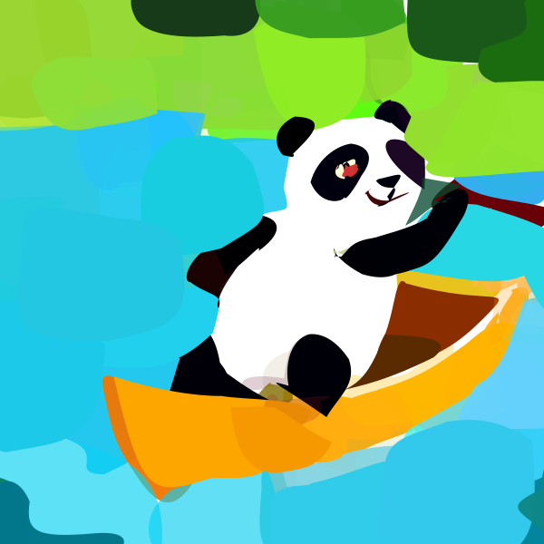
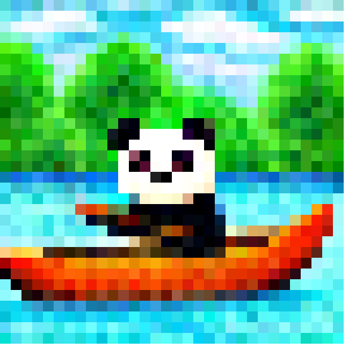

VectorFusion
===============

.. _vectorfusion:

`[Project] <https://vectorfusion.github.io/>`_ `[Paper] <https://openaccess.thecvf.com/content/CVPR2023/papers/Jain_VectorFusion_Text-to-SVG_by_Abstracting_Pixel-Based_Diffusion_Models_CVPR_2023_paper.pdf>`_

The VectorFusion algorithm was proposed in *VectorFusion: Text-to-SVG by Abstracting Pixel-Based Diffusion Models*.

The abstract from the paper is:

`Diffusion models have shown impressive results in text-to-image synthesis. Using massive datasets of captioned images, diffusion models learn to generate raster images of highly diverse objects and scenes. However, designers frequently use vector representations of images like Scalable Vector Graphics (SVGs) for digital icons or art. Vector graphics can be scaled to any size, and are compact. We show that a text-conditioned diffusion model trained on pixel representations of images can be used to generate SVGexportable vector graphics. We do so without access to large datasets of captioned SVGs. By optimizing a differentiable vector graphics rasterizer, our method, VectorFusion, distills abstract semantic knowledge out of a pretrained diffusion model. Inspired by recent text-to-3D work, we learn an SVG consistent with a caption using Score Distillation Sampling. To accelerate generation and improve fidelity, VectorFusion also initializes from an image sample. Experiments show greater quality than prior work, and demonstrate a range of styles including pixel art and sketches.`

**Examples:**
^^^^^^^^^^^

VectorFusion synthesizes SVGs in various styles based on text prompts.

Iconography
""""""""""""

Synthesize an iconographic of *a panda rowing a boat in a pond*.

.. code-block:: console

   $ python svg_render.py x=vectorfusion prompt='a panda rowing a boat in a pond. minimal flat 2d vector icon. lineal color. trending on artstation.'

You will get the following result:

.. image:: ../../examples/vectorfusion/vectorfusion_panda_icon.svg
   :width: 224

Synthesize an iconographic of *a panda rowing a boat in a pond* from scratch.

.. code-block:: console

   $ python svg_render.py x=vectorfusion x.skip_live=True prompt='a panda rowing a boat in a pond. minimal flat 2d vector icon. lineal color. trending on artstation.'

You will get the following result:

Pixel Art
""""""""""""

Synthesize a pixel art of *a panda rowing a boat in a pond*.

.. code-block:: console

   $ python svg_render.py x=vectorfusion x.style='pixelart' x.image_size=512 prompt='a panda rowing a boat in a pond. pixel art. trending on artstation.'

You will get the following result:

Sketch
""""""""""""

Synthesize a sketch of *a panda rowing a boat in a pond*.

.. code-block:: console

   $ python svg_render.py x=vectorfusion x.style='sketch' x.skip_live=True prompt='a panda rowing a boat in a pond. minimal 2d line drawing. trending on artstation.'

You will get the following result:

